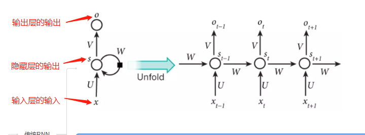
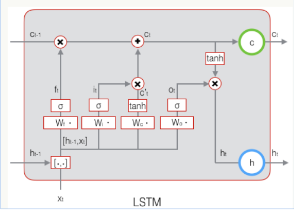
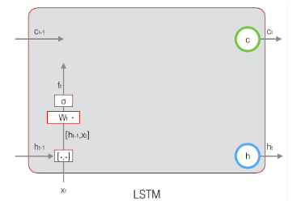
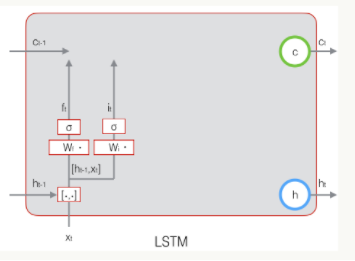
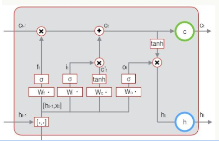
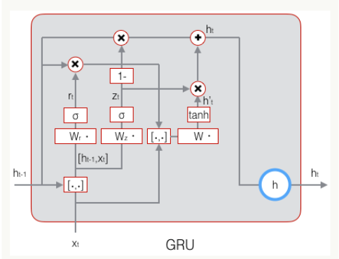

# 【关于 RNN】那些你不知道的事

> 作者：杨夕、芙蕖、李玲、陈海顺、twilight、LeoLRH、JimmyDU、张永泰
> 
> 介绍：本项目是作者们根据个人面试和经验总结出的自然语言处理(NLP)面试准备的学习笔记与资料，该资料目前包含 自然语言处理各领域的 面试题积累。
> 
> NLP 百面百搭 地址：https://github.com/km1994/NLP-Interview-Notes
> 
> **[手机版NLP百面百搭](https://mp.weixin.qq.com/s?__biz=MzAxMTU5Njg4NQ==&mid=100005719&idx=3&sn=5d8e62993e5ecd4582703684c0d12e44&chksm=1bbff26d2cc87b7bf2504a8a4cafc60919d722b6e9acbcee81a626924d80f53a49301df9bd97&scene=18#wechat_redirect)**
> 
> 推荐系统 百面百搭 地址：https://github.com/km1994/RES-Interview-Notes
> 
> **[手机版推荐系统百面百搭](https://mp.weixin.qq.com/s/b_KBT6rUw09cLGRHV_EUtw)**
> 
> 搜索引擎 百面百搭 地址：https://github.com/km1994/search-engine-Interview-Notes 【编写ing】
> 
> NLP论文学习笔记：https://github.com/km1994/nlp_paper_study
> 
> 推荐系统论文学习笔记：https://github.com/km1994/RS_paper_study
> 
> GCN 论文学习笔记：https://github.com/km1994/GCN_study
> 
> **推广搜 军火库**：https://github.com/km1994/recommendation_advertisement_search

> **关注公众号 【关于NLP那些你不知道的事】 加入 【NLP && 推荐学习群】一起学习！！！**

## 一、RNN 篇

### 1.2 为什么需要 RNN?

无论是 全连接网络 还是 卷积神经网络 他们的前提假设都是 元素间相互独立，也就是输入和输出的一一对应，也就是一个输入得到一个输出。不同的输入之间是没有联系的。

然而，在 序列数据（自然语言处理任务、时间序列任务）中，对于每一个输出，他不仅和他所对应的输入相关，还与前面其他词 和 词间的顺序相关。

这个时候，全连接网络 还是 卷积神经网络 将不能很好解决该问题。

RNN 之所以被称为"循环"，是因为它对序列中的每个元素执行相同的任务，输出取决于先前的计算。考虑RNN的另一种方式是它们有一个“记忆”，它可以捕获到目前为止计算的信息。

### 1.2 RNN 结构是怎么样的？

从 上面图片中，可以看出 RNN网络 的 核心在于 $s_t$ 的值 不仅取决 xt，而且还与 $s_{t-1}$ 相关。

### 1.3 RNN 前向计算公式？

- 第一步，计算隐藏层的输出值

> 注：f 为隐藏层的激活函数，一般用 softmax 函数

- 第二步，计算输出层的输出值

> 注：g 为输出层的激活函数，一般用 tanh 函数 或者 ReLU 函数

### 1.4 RNN 存在什么问题？

1. 梯度消失和梯度爆炸 问题

- 原因
  
误差沿时间反向传播：

矩阵的模的值取决 于 上图 红框部分：

> 当其大于1时，随着RNN深度的增加，矩阵的模的值呈指数函数增加，此时将出现 梯度爆炸；
> 
> 当其小于1时，随着RNN深度的增加，矩阵的模的值呈指数函数减少，此时将出现 梯度消失；

- 解决方法
  - 梯度消失问题解决方法：
    - 合理的初始化权重值；
    - 使用relu代替sigmoid和tanh作为激活函数；
    - 使用其他结构的RNNs；
  - 梯度爆炸问题解决方法：
    - 设置一个梯度阈值，当梯度超过这个阈值的时候可以直接截取

2. 长距离的依赖问题

导致训练时梯度不能在较长序列中一直传递下去，从而使RNN无法捕捉到长距离的影响

## 二、长短时记忆网络(Long Short Term Memory Network, LSTM) 篇

### 2.1 为什么 需要 LSTM?

RNN  梯度消失和梯度爆炸问题

### 2.2 LSTM 的结构是怎么样的?

### 2.3 LSTM 如何缓解 RNN 梯度消失和梯度爆炸问题?

- 引用门控机制
  - 遗忘门：控制继续保存长期状态c；
  - 输入门：控制把即时状态输入到长期状态c；
  - 输出门：控制是否把长期状态c作为当前的LSTM的输出；

- 原理：门实际上就是一层全连接层，它的输入是一个向量，输出是一个0到1之间的实数向量。

### 2.3 LSTM 的流程是怎么样的?

1. 遗忘门计算

> δ 是 sigmoid 函数

2. 输入门

3. 计算用于描述当前输入的 单元状态

4. 计算当前时刻的单元状态

5. 输出门

6. 最终输出

### 2.4 LSTM 中激活函数区别?

- 门控的激活函数为 sigmoid；
- 输出的激活函数为tanh函数；

### 2.5 LSTM的复杂度？

序列长度为T，隐藏层维度为H

O(T * H^2)

### 2.6 LSTM 存在什么问题？

计算量大

## 三、GRU (Gated Recurrent Unit)

### 3.1 为什么 需要 GRU?

LSTM 计算量大

### 3.2 GRU 的结构是怎么样的?

### 3.3 GRU 的前向计算?

- 重置门（reset gate）的计算：

- 候选激活值（candidate activation）的计算

- 更新门（update gate）的计算

- 激活值的计算

### 3.4 GRU 与其他 RNN系列模型的区别？

GRU输入输出的结构与普通的RNN相似，其中的内部思想与LSTM相似。

与LSTM相比，GRU内部少了一个”门控“，参数比LSTM少，但是却也能够达到与LSTM相当的功能。考虑到硬件的计算能力和时间成本，因而很多时候我们也就会选择更加”实用“的GRU啦。

## 四、RNN系列模型篇

### 4.1 RNN系列模型 有什么特点？

- 具有记忆能力：针对文本序列，能够从头到尾阅读文章中每个单词，将前面阅读到的有用信息编码到状态变量中，从而拥有一定记忆能力，可更好理解之后的内容

## 参考

1. [循环神经网络(RNN)知识入门](https://zhuanlan.zhihu.com/p/149869659)
2. [LSTM基本原理](https://docs.rnn.knowledge-precipitation.site/lstm-ji-ben-yuan-li)
3. [循环神经网络 – Recurrent Neural Network | RNN](https://easyai.tech/ai-definition/rnn/)
4. [循环神经网络--传统RNN、LSTM循序渐进的通俗易懂解释](https://blog.csdn.net/weixin_40363423/article/details/89925364)

